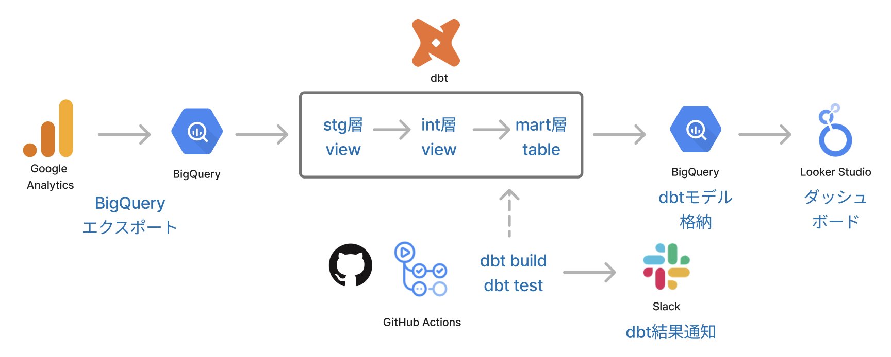
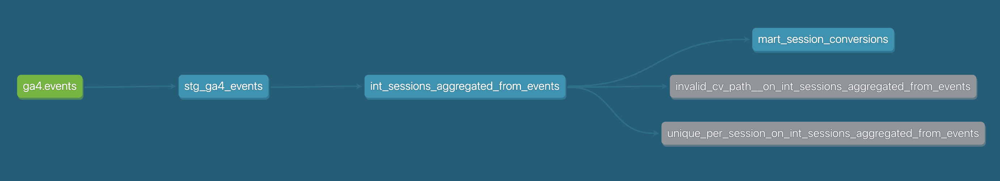

# ga4_dbt_mart

Google Analytics 4（GA4）から BigQuery にエクスポートされたイベントデータを元に、セッション単位のKPI（コンバージョン、チャネル別集計等）を効率的に可視化・分析できる状態に整備します。

GitHub Actions によって定期的に `dbt build` および `dbt test` が実行され、BigQuery上のマートテーブルが更新されます。結果は Slack に通知され、Looker Studio からの可視化に常に最新のデータが利用可能な状態となります。


※ Logos are property of their respective owners. Used here for illustrative, non-commercial purposes.

## ディレクトリ構成
```bash
models/
  staging/       # GA4の `event_params` や `user_properties` を整形・横持ち化
  intermediate/  # セッション単位などの分析軸で集約
  marts/         # 可視化・レポート用の指標を整備（例：CV数、流入チャネル別集計）

macros/          # カスタムマクロ類
tests/           # dbt singular test 定義

.github/
  workflows      # dbt run を定期実行、push時にlintを実行
```



## 使用技術・ライブラリ

- Python 3.11
- [Poetry](https://python-poetry.org/)
- [dbt-core](https://docs.getdbt.com/docs/introduction)
- [dbt-bigquery](https://docs.getdbt.com/reference/warehouse-profiles/bigquery-profile)
- BigQuery


## セットアップ手順（ローカル開発）

0. GCP 側の前提設定
本プロジェクトをローカル環境から実行するには、以下の Google Cloud 側の準備が必要です。
- BigQuery API が有効になっている GCP プロジェクトを用意
- サービスアカウントを作成し、以下のロールを付与
  - `BigQuery Data Editor`
  - `BigQuery Job User`
- サービスアカウントのキーファイル（`.json`）を生成し、`~/.dbt/profiles.yml` から参照可能なパスに配置

- 詳細な手順については以下の公式ドキュメントを参照してください：
  - [Creating and managing service accounts](https://cloud.google.com/iam/docs/creating-managing-service-accounts)
  - [Granting roles to service accounts](https://cloud.google.com/iam/docs/granting-roles-to-service-accounts)


1. 仮想環境の構築と起動

```bash
poetry install
poetry shell
```

2. pre-commit フックを有効化（初回のみ）

```bash
pre-commit install
```

3. BigQuery 接続情報を作成（初回のみ）

~/.dbt/profiles.yml に以下を記載
```yaml
ga4_dbt_mart:
  outputs:
    dev:
      type: bigquery
      method: service-account  # ローカルではキーファイルを用いた認証を使用
      project: your-gcp-project-id
      dataset: dbt_dev
      location: your-bigquery-location
      threads: 4
      keyfile: /absolute/path/to/your/keyfile.json
  target: dev
```

4. 接続確認

```bash
dbt debug
```

5. モデルの実行

```bash
dbt run --target dev --vars '{"start_date": "YYYYMMDD", "end_date": "YYYYMMDD", "ga4_dataset": "your_ga4_dataset"}'
```
